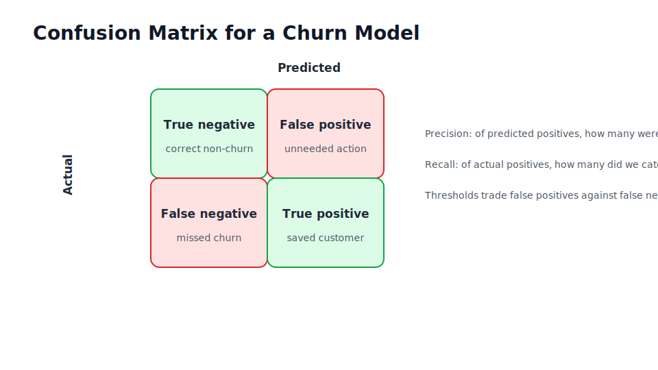
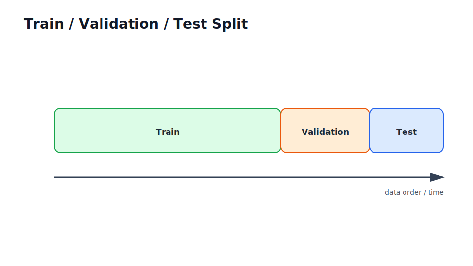
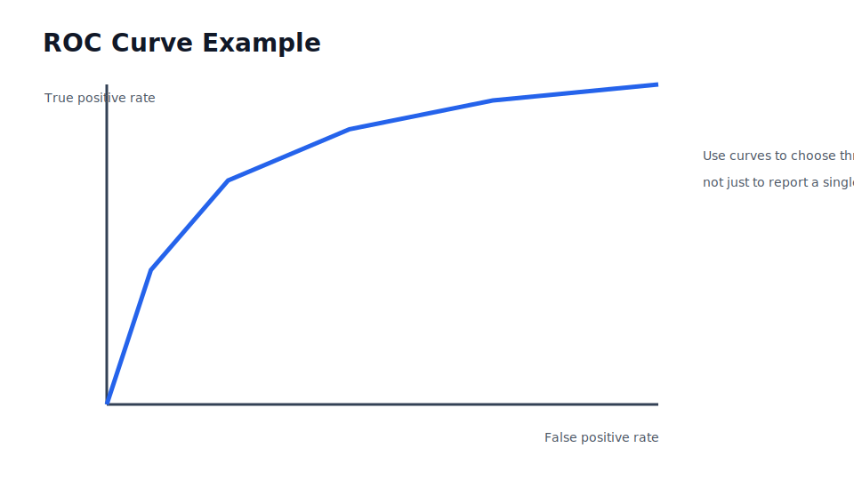
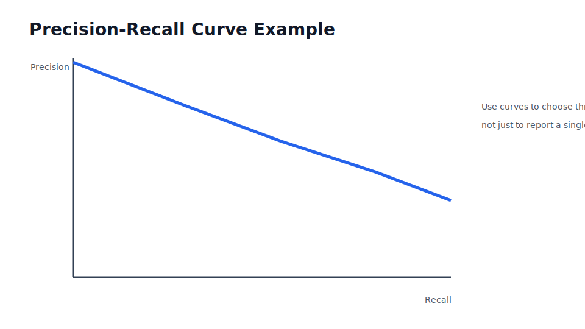

# Model Evaluation and Experiment Design

## What you will learn

By the end of this chapter, you will be able to:

- explain the role of model evaluation and experiment design in production AI delivery
- connect the concept to enterprise constraints
- identify the main implementation and governance risks

## Why this matters in industry

In a notebook, you can focus on whether an idea works. In production, you also need stable inputs, reliable outputs, monitoring, rollback, ownership, and tests. In an enterprise, you must additionally consider identity, access control, audit evidence, change control, procurement, and support.

This chapter explains how model evaluation and experiment design fits into that wider delivery system.

## Mental model

Treat every AI capability as a service with a contract. The model is only one component. The surrounding system decides who can use it, what data it can see, how failures are handled, and how the organisation knows whether it is still working.

## Core concepts

- Separate train, validation, and test data before tuning.
- Use cross-validation for small independent datasets and time-based splits for forecasting or event streams.
- Report confusion matrix, precision, recall, F1, ROC-AUC, PR-AUC, calibration, and threshold trade-offs when they matter.
- Tie machine learning metrics to a business key performance indicator (KPI), such as retained revenue or analyst review hours saved.
- Maintain golden datasets and error analysis notes so future releases can be compared honestly.

## Running example: Enterprise Document Q&A Assistant

In the document Q&A assistant, employees ask questions about internal policies, project notes, architecture decisions, and operating procedures. The assistant must answer from approved documents, cite sources, respect document-level access control, and leave enough evidence for audit and improvement.

For this chapter, ask: what would break if this topic were handled only as a notebook experiment?

## Practical example

```python
from dataclasses import dataclass

@dataclass
class Costs:
    false_positive: float = 5.0
    false_negative: float = 80.0

def expected_cost(y_true: list[int], scores: list[float], threshold: float, costs: Costs) -> float:
    predictions = [int(score >= threshold) for score in scores]
    fp = sum(pred == 1 and actual == 0 for pred, actual in zip(predictions, y_true))
    fn = sum(pred == 0 and actual == 1 for pred, actual in zip(predictions, y_true))
    return fp * costs.false_positive + fn * costs.false_negative

y = [0, 0, 1, 1, 1]
scores = [0.10, 0.55, 0.40, 0.70, 0.90]
for threshold in [0.3, 0.5, 0.7]:
    print(threshold, expected_cost(y, scores, threshold, Costs()))
```

## Visual explanation



## Common mistakes

- Optimising a local metric without checking the business workflow.
- Treating a prototype as production because it worked once.
- Ignoring identity, data boundaries, and auditability until late delivery.
- Shipping without a regression set or operational runbook.

## Production considerations

- Scale: estimate request volume, data size, and peak usage.
- Latency: separate interactive paths from batch or background work.
- Cost: track compute, storage, tokens, and human review effort.
- Security: validate inputs, enforce identity, and minimise privileges.
- Monitoring: log request IDs, model versions, prompt versions, errors, latency, and quality signals.
- Governance: record decisions, approvals, risks, and release evidence.
- Maintainability: keep examples small, tested, and documented.

## Checklist

- [ ] The problem is tied to a real workflow and measurable outcome.
- [ ] Inputs and outputs are defined.
- [ ] Evaluation covers quality and business risk.
- [ ] Security and identity assumptions are explicit.
- [ ] Monitoring and support ownership are defined.
- [ ] The implementation can be tested without private credentials.

## Key takeaways

- Production AI is a system, not a model file.
- Enterprise delivery requires identity, controls, observability, and support.
- Evaluation must include business impact and failure analysis.
- Reusable contracts and checklists reduce delivery risk.
- The running document Q&A assistant is the reference case study for the book.

## Exercises

- Beginner exercise: describe how this topic appears in a notebook prototype.
- Intermediate exercise: list the production controls needed before release.
- Advanced exercise: write a short review checklist for an architecture review.

## Chapter-specific coverage

- Use train/validation/test splits for independent data and time-based splits for temporal prediction.
- Use baselines, golden datasets, threshold analysis, calibration, and business KPI translation.
- Evaluation is incomplete until major error clusters are inspected and explained to stakeholders.

## Further reading

- [Quarto books](https://quarto.org/docs/books/)
- [NIST AI Risk Management Framework](https://www.nist.gov/itl/ai-risk-management-framework)
- [OWASP Top 10 for Large Language Model Applications](https://owasp.org/www-project-top-10-for-large-language-model-applications/)
- [Model Context Protocol specification](https://modelcontextprotocol.io/specification/)

## Deeper theory: what each metric is really measuring

Accuracy is the fraction of correct predictions. It is useful only when classes are reasonably balanced and the cost of each error is similar. In fraud detection, churn prediction, defect detection, and safety review, accuracy can be actively misleading because the rare class is usually the class the business cares about.

Precision answers: when the model predicts positive, how often is it right? Recall answers: of all real positives, how many did the model catch? F1 is the harmonic mean of precision and recall, so it punishes a model that does well on one and poorly on the other.

Receiver Operating Characteristic Area Under the Curve (ROC-AUC) measures ranking quality across false-positive-rate thresholds. Precision-Recall Area Under the Curve (PR-AUC) is often more informative for imbalanced positive classes because it focuses on positive predictions. Calibration asks whether predicted probabilities mean what they say: among cases scored near 0.8, about 80% should be positive.







## Stakeholder evaluation report

A practical evaluation report should include:

- the decision being supported
- the data window and split strategy
- baseline performance
- chosen threshold and why
- confusion matrix at the operating threshold
- business cost or value estimate
- top error categories with examples
- known risks, caveats, and release recommendation
