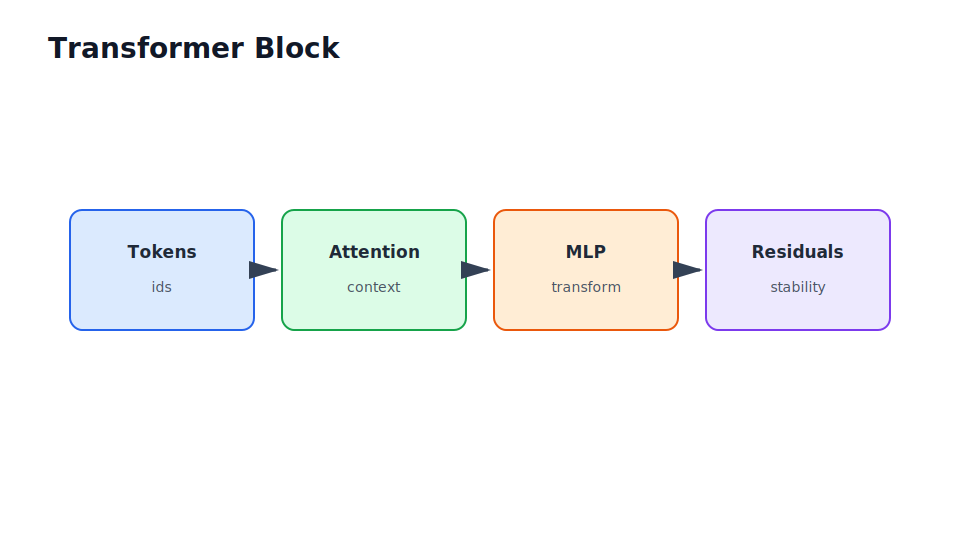

# Deep Learning Foundations

Part II

This part connects familiar classification ideas to neural networks, PyTorch training loops, debugging practice, convolutional models, sequence models, transformers, and embeddings.

## Flow Through This Part

<section class="flow-strip">
  <article class="flow-step">Neuron
Move from logistic regression to layered representations.
</article>
  <article class="flow-step">Train
Use Dataset, DataLoader, model classes, losses, optimizers, and validation loops.
</article>
  <article class="flow-step">Debug
Diagnose loss curves, gradients, shape errors, label bugs, and overfitting.
</article>
  <article class="flow-step">Structure
Learn CNNs, sequence models, attention, transformers, and embeddings.
</article>
</section>

## Why It Matters

Large Language Models (LLMs) are not magic APIs. They are neural networks trained at large scale. You do not need to derive every transformer equation to use LLMs well, but you do need enough mental model to reason about context windows, embeddings, inference cost, failure modes, fine-tuning, and evaluation.

## Running Case Study Link

The document Q&A assistant depends on embeddings, transformer-based generation, retrieval ranking, and evaluation of generated answers. This part gives you the vocabulary to understand those components without treating them as black boxes.

## Visual Anchor

## Read Next

If you already know neural networks, skim the PyTorch and debugging chapters and spend more time on transformers and embeddings.
