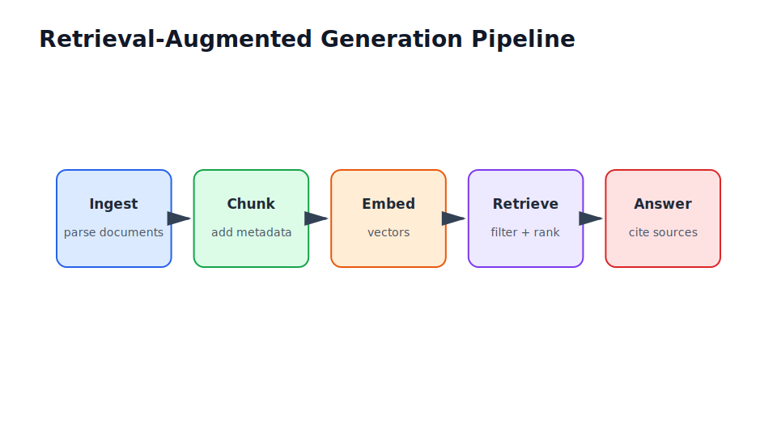

# Modern LLM Application Development

Part III

This part is where the book shifts from model training to product behaviour. LLM applications are probabilistic systems wrapped in deterministic software, retrieval systems, prompts, tools, tests, safety controls, and cost constraints.

## Flow Through This Part

<section class="flow-strip">
  <article class="flow-step">Different
Compare traditional ML with prompting, retrieval, workflows, and agents.
</article>
  <article class="flow-step">Prompt
Use system, developer, and user messages with versioning and regression tests.
</article>
  <article class="flow-step">Retrieve
Build RAG with ingestion, chunking, metadata, permissions, reranking, and citations.
</article>
  <article class="flow-step">Evaluate
Measure retrieval quality, factuality, citation accuracy, safety, cost, and latency.
</article>
  <article class="flow-step">Adapt
Choose between prompting, RAG, fine-tuning, and preference optimisation.
</article>
</section>

## Industry Thread

In a notebook, you can ask an LLM a few questions and inspect the answers. In production, you need expected answer criteria, regression tests, cost budgets, prompt versioning, citation checks, and release gates. In an enterprise, you additionally need permission-aware retrieval and evidence for risk review.

## Running Case Study Link

This is the core part for the enterprise document Q&A assistant. The RAG chapter explains the ingestion-to-answer path, and the evaluation chapter explains how to decide whether the assistant is ready for a pilot.

## Visual Anchor

## Read Next

Read the first five chapters of this part together before jumping to fine-tuning. Most enterprise LLM problems need better prompting, retrieval, and evaluation before they need fine-tuning.
