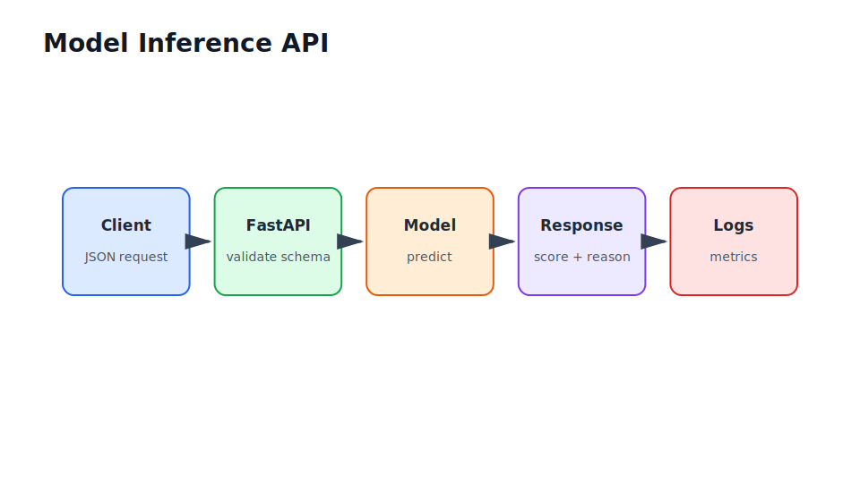

# Backend Engineering for Data Scientists

Part IV

This part turns model and LLM logic into services. The practical goal is to make a data scientist comfortable reading, writing, testing, and operating a small production-facing API.

## Flow Through This Part

<section class="flow-strip">
  <article class="flow-step">Contract
Understand why notebooks need APIs, schemas, tests, and monitoring.
</article>
  <article class="flow-step">HTTP
Learn methods, status codes, JSON, headers, validation, and OpenAPI.
</article>
  <article class="flow-step">Serve
Load a model, validate requests, return predictions, log outcomes, and test endpoints.
</article>
  <article class="flow-step">Scale
Add background jobs, concurrency discipline, Docker, deployment, and observability.
</article>
</section>

## Industry Thread

In a notebook, you call a Python function. In production, another system calls an endpoint. In an enterprise, that endpoint needs authentication, request IDs, audit logs, rate limits, dependency ownership, and a rollback path.

## Running Case Study Link

The document Q&A assistant needs an authenticated API for questions, retrieval, answer generation, feedback capture, evaluation runs, and admin workflows.

## Visual Anchor

## Read Next

Read this part before the security chapters. Identity and governance are much easier to understand once the API boundary is clear.
