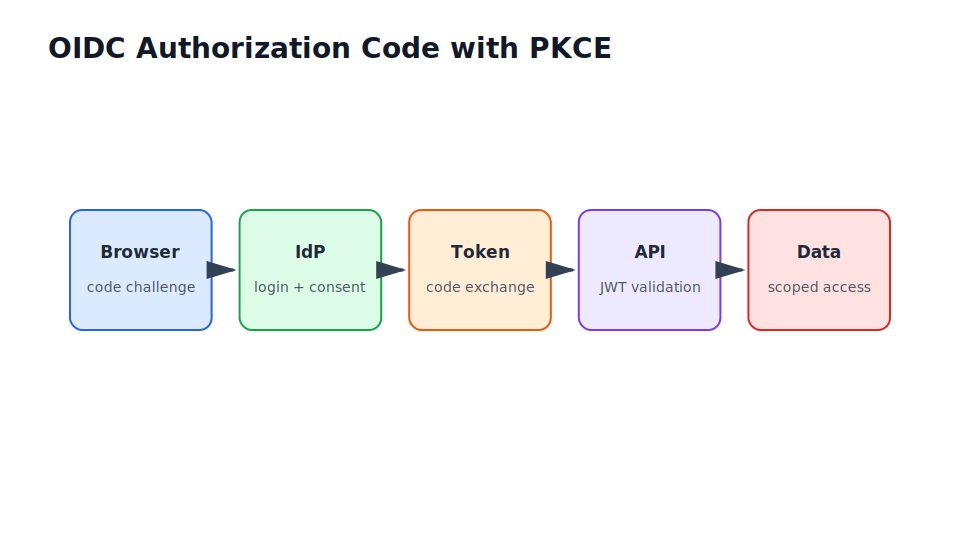

# OAuth2, OIDC, PKCE, JWTs, and SSO


::: {.callout-note}
Version note

OAuth and OpenID Connect implementation details change across identity providers. Use official provider documentation and validate issuer, audience, expiry, and key rotation behaviour.
:::

## What you will learn

By the end of this chapter, you will be able to:

- explain the role of oauth2, oidc, pkce, jwts, and sso in production AI delivery
- connect the concept to enterprise constraints
- identify the main implementation and governance risks

## Why this matters in industry

In a notebook, you can focus on whether an idea works. In production, you also need stable inputs, reliable outputs, monitoring, rollback, ownership, and tests. In an enterprise, you must additionally consider identity, access control, audit evidence, change control, procurement, and support.

This chapter explains how oauth2, oidc, pkce, jwts, and sso fits into that wider delivery system.

## Mental model

Treat every AI capability as a service with a contract. The model is only one component. The surrounding system decides who can use it, what data it can see, how failures are handled, and how the organisation knows whether it is still working.

## Core concepts

- OAuth2 is an authorization framework; OpenID Connect (OIDC) adds authentication and identity claims.
- Proof Key for Code Exchange (PKCE) protects public clients during authorization-code exchange.
- JSON Web Tokens (JWTs) must be validated for signature, issuer, audience, expiry, and relevant claims.
- Access tokens authorize API calls; ID tokens identify the authenticated user; refresh tokens renew sessions under provider policy.
- Groups, scopes, tenants, and claims become authorization inputs inside enterprise APIs.

## Running example: Enterprise Document Q&A Assistant

In the document Q&A assistant, employees ask questions about internal policies, project notes, architecture decisions, and operating procedures. The assistant must answer from approved documents, cite sources, respect document-level access control, and leave enough evidence for audit and improvement.

For this chapter, ask: what would break if this topic were handled only as a notebook experiment?

## Practical example

```python
def production_question(notebook_step: str) -> str:
    return f"What has to be repeatable, observable, and secure when {notebook_step} moves to production?"

print(production_question("a model prediction"))
```

## Visual explanation



## Common mistakes

- Optimising a local metric without checking the business workflow.
- Treating a prototype as production because it worked once.
- Ignoring identity, data boundaries, and auditability until late delivery.
- Shipping without a regression set or operational runbook.

## Production considerations

- Scale: estimate request volume, data size, and peak usage.
- Latency: separate interactive paths from batch or background work.
- Cost: track compute, storage, tokens, and human review effort.
- Security: validate inputs, enforce identity, and minimise privileges.
- Monitoring: log request IDs, model versions, prompt versions, errors, latency, and quality signals.
- Governance: record decisions, approvals, risks, and release evidence.
- Maintainability: keep examples small, tested, and documented.

## Checklist

- [ ] The problem is tied to a real workflow and measurable outcome.
- [ ] Inputs and outputs are defined.
- [ ] Evaluation covers quality and business risk.
- [ ] Security and identity assumptions are explicit.
- [ ] Monitoring and support ownership are defined.
- [ ] The implementation can be tested without private credentials.

## Key takeaways

- Production AI is a system, not a model file.
- Enterprise delivery requires identity, controls, observability, and support.
- Evaluation must include business impact and failure analysis.
- Reusable contracts and checklists reduce delivery risk.
- The running document Q&A assistant is the reference case study for the book.

## Exercises

- Beginner exercise: describe how this topic appears in a notebook prototype.
- Intermediate exercise: list the production controls needed before release.
- Advanced exercise: write a short review checklist for an architecture review.

## Chapter-specific coverage

- OAuth2 authorises access; OpenID Connect (OIDC) authenticates users and carries identity claims.
- Proof Key for Code Exchange (PKCE) protects public clients from authorization-code interception.
- JSON Web Token (JWT) validation must check signature, issuer, audience, expiry, key ID, and claim semantics.

## Further reading

- [Quarto books](https://quarto.org/docs/books/)
- [NIST AI Risk Management Framework](https://www.nist.gov/itl/ai-risk-management-framework)
- [OWASP Top 10 for Large Language Model Applications](https://owasp.org/www-project-top-10-for-large-language-model-applications/)
- [Model Context Protocol specification](https://modelcontextprotocol.io/specification/)
