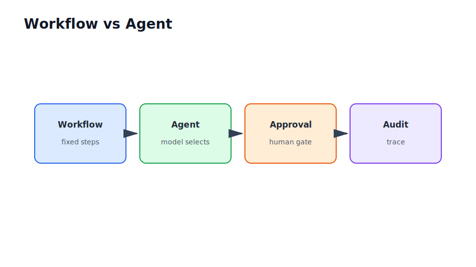

# Agentic Systems and Protocols

Part VI

This part separates useful agent patterns from hype. An agent is not every LLM workflow. Agentic systems use model-driven decisions, state, tools, memory, and approval gates; deterministic workflows remain better when the process is known.

## Flow Through This Part

<section class="flow-strip">
  <article class="flow-step">Decide
Distinguish workflows, agents, planning, autonomy, and approval gates.
</article>
  <article class="flow-step">Constrain
Design tool schemas, validation, scoped permissions, retries, and audit logs.
</article>
  <article class="flow-step">Connect
Use Model Context Protocol (MCP) concepts for tools, resources, prompts, and servers.
</article>
  <article class="flow-step">Coordinate
Understand Agent-to-Agent (A2A) coordination and framework trade-offs.
</article>
  <article class="flow-step">Observe
Evaluate and monitor agent behaviour, tool use, cost, latency, and failure modes.
</article>
</section>

## Industry Thread

In a demo, an agent can call a tool and produce a convincing answer. In production, the tool call needs argument validation, permission checks, idempotency, logs, and fallback behaviour. In an enterprise, dangerous actions often require human approval.

## Running Case Study Link

The document Q&A assistant might use tools to search documents, file support tickets, request access, summarize incidents, or draft policy updates. This part explains how to expose those capabilities without giving the model uncontrolled authority.

## Visual Anchor

## Read Next

Read tool safety before MCP. Protocols do not replace security boundaries; they make integration easier.
