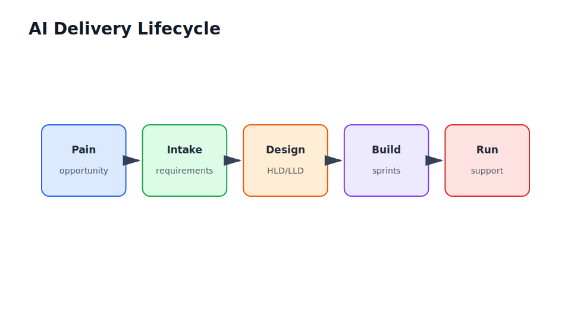

# Enterprise AI Delivery Lifecycle

Part VII

This part is the senior-practice playbook. It explains how an AI lead turns a business problem into an evaluated, reviewed, deployed, supported system.

## Flow Through This Part

<section class="flow-strip">
  <article class="flow-step">Qualify
Decide whether AI is appropriate or whether rules, automation, or dashboards are better.
</article>
  <article class="flow-step">Intake
Capture sponsor, users, data, access, compliance, metrics, timeline, and reviewers.
</article>
  <article class="flow-step">Respond
Write the AI lead response: approach, assumptions, risks, architecture, evaluation, phases.
</article>
  <article class="flow-step">Design
Move from kickoff to HLD, LLD, Architecture Decision Records (ADRs), and sprint plan.
</article>
  <article class="flow-step">Launch
Plan environments, CI/CD, secrets, monitoring, pilot users, rollback, support, and review.
</article>
</section>

## Industry Thread

In a notebook, success is a result. In production, success is an operating service. In an enterprise, success also means accountable ownership, sign-off, audit evidence, support readiness, and a path to stop or roll back.

## Running Case Study Link

This part walks the document Q&A assistant through intake, architecture review, delivery planning, rollout, and support. It is the bridge from technical design to organizational delivery.

## Visual Anchor

## Read Next

Use this part as a checklist during a real project. The first seven days chapter is especially useful when a new AI initiative has unclear ownership.
